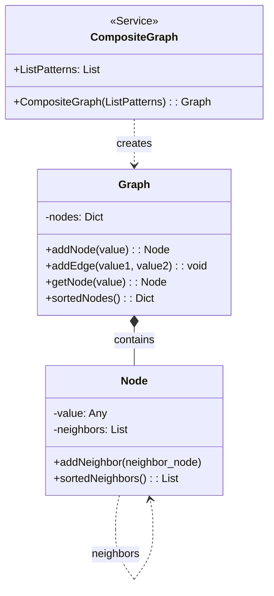
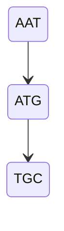

# Composite Graph Implementation Documentation

This document explains the implementation of a Composite Graph data structure that consists of Node and Graph classes, along with a CompositeGraph function for creating specific graph patterns.

## Structure Overview

### UML Class Diagram



### Pseudocode Implementation

    NODE(value)
        value ← value
        neighbors ← empty list
    
        ADDNEIGHBOR(neighbor_node)
            append neighbor_node to neighbors
    
        SORTEDNEIGHBORS()
            return sorted neighbors list
        
    GRAPH()
        nodes ← empty dictionary
    
        ADDNODE(value)
            if value is not in nodes
                new_node ← NODE(value)
                add new_node to nodes with key value
                return new_node
        return existing node with value
    
        ADDEDGE(value1, value2)
            node1 ← ADDNODE(value1)
            node2 ← ADDNODE(value2)
            node1.ADDNEIGHBOR(node2)
    
        GETNODE(value)
            return node from nodes with key value
    
        SORTEDNODES()
            return sorted dictionary of nodes

    COMPOSITEGRAPH(ListPatterns)
        graph ← GRAPH()
        k ← length of first pattern in ListPatterns
        for each Pattern in ListPatterns
            prefix ← Pattern from position 0 to k-1
            suffix ← Pattern from position 1 to k
            graph.ADDEDGE(prefix, suffix)
        return graph


## Detailed Component Explanation

### 1. Node Class
The Node class represents vertices in the graph:
- **Attributes**:
  - `value`: Stores the node's identifier or data
  - `neighbors`: A list containing references to adjacent nodes
- **Methods**:
  - `ADDNEIGHBOR`: Adds a new node to the neighbors list
  - `SORTEDNEIGHBORS`: Returns a sorted list of neighboring nodes

### 2. Graph Class
The Graph class manages the overall graph structure:
- **Attributes**:
  - `nodes`: A dictionary storing all nodes, with values as keys
- **Methods**:
  - `ADDNODE`: Creates or retrieves a node with the given value
  - `ADDEDGE`: Establishes a connection between two nodes
  - `GETNODE`: Retrieves a node by its value
  - `SORTEDNODES`: Returns a sorted dictionary of all nodes

### 3. CompositeGraph Function
A utility function that constructs a specific type of graph:
- Takes a list of patterns as input
- Creates edges based on overlapping pattern segments
- Returns a constructed Graph object

## Implementation Details

### Node Management
- Nodes are uniquely identified by their values
- Each node maintains its own list of neighbors
- Neighbors can be sorted for consistent traversal

### Edge Handling
- Edges are directed by default
- Multiple edges between the same nodes are possible
- Edge creation automatically handles node creation if needed

### Graph Construction
The CompositeGraph function:
1. Creates a new empty graph
2. Processes each pattern in the input list
3. Creates edges based on pattern overlaps
4. Maintains connections in the resulting graph structure

## Usage Example
```python
# Create a composite graph from patterns
patterns = ["AAT", "ATG", "TGC"] 
graph = CompositeGraph(patterns)
# This will create a graph with edges:
# AAT → ATG
# ATG → TGC
```

## Time Complexity

- Node operations: O(1) for creation and neighbor addition
- Edge addition: O(1)
- Node retrieval: O(1)
- Sorted operations: O(n log n) where n is the number of nodes/neighbors
- CompositeGraph construction: O(m) where m is the total length of all patterns

## Space Complexity

- Node storage: O(n) where n is the number of nodes
- Edge storage: O(e) where e is the number of edges
- Total graph storage: O(n + e)
