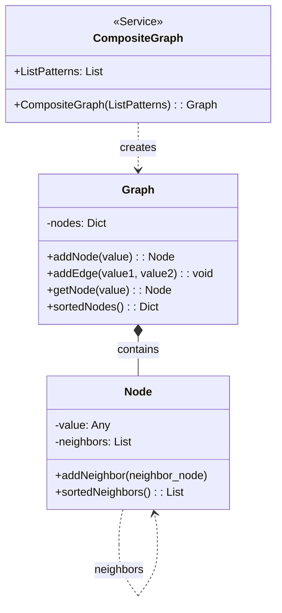

# Composite Graph Implementation Documentation

This document explains the implementation of a Composite Graph data structure that consists of Node and Graph classes, along with a CompositeGraph function for creating specific graph patterns.

## Structure Overview

### UML Class Diagram

### Pseudocode Implementation

NODE(value)
    value ← value neighbors ← empty list

ADDNEIGHBOR(neighbor_node)
    append neighbor_node to neighbors

SORTEDNEIGHBORS()
    return sorted neighbors list
