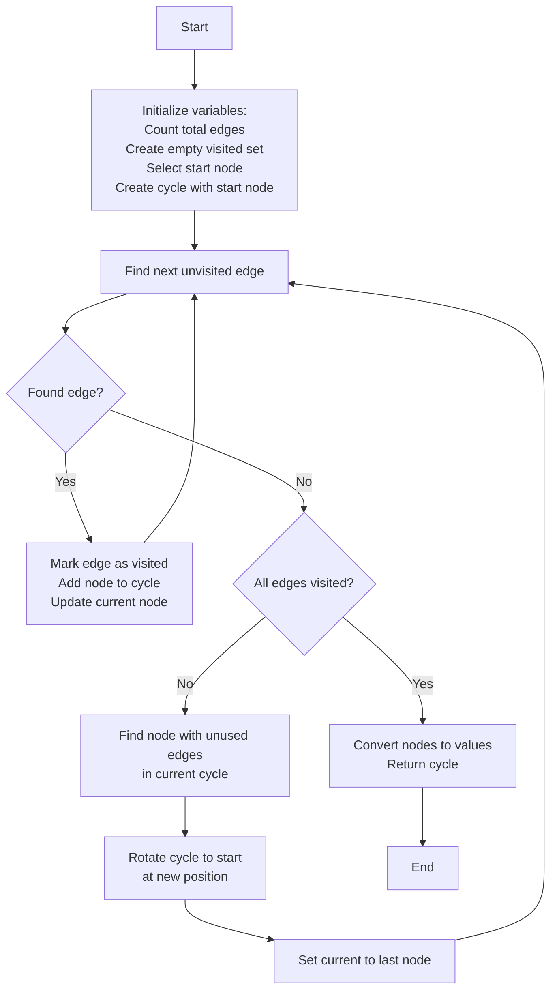

```mermaid
graph TD
    A[Start] --> B[Initialize variables:<br>Count total edges<br>Create empty visited set<br>Select start node<br>Create cycle with start node]
    B --> C[Find next unvisited edge]
    C --> D{Found edge?}
    D -->|Yes| E[Mark edge as visited<br>Add node to cycle<br>Update current node]
    E --> C
    D -->|No| F{All edges visited?}
    F -->|No| G[Find node with unused edges<br>in current cycle]
    G --> H[Rotate cycle to start<br>at new position]
    H --> I[Set current to last node]
    I --> C
    F -->|Yes| J[Convert nodes to values<br>Return cycle]
    J --> K[End]
```

```mermaid
graph
```