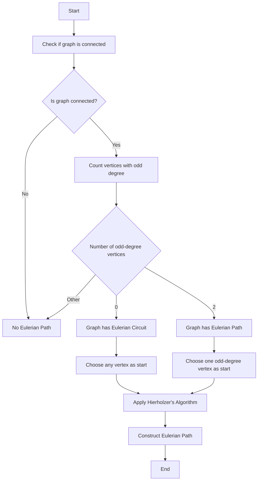

```mermaid
graph TD
    A[Start] --> B[Check if graph is connected]
    B --> C{Is graph connected?}
    C -->|No| Z[No Eulerian Path]
    C -->|Yes| D[Count vertices with odd degree]
    D --> E{Number of odd-degree vertices}
    E -->|0| F[Graph has Eulerian Circuit]
    E -->|2| G[Graph has Eulerian Path]
    E -->|Other| Z
    F --> H[Choose any vertex as start]
    G --> I[Choose one odd-degree vertex as start]
    H --> J[Apply Hierholzer's Algorithm]
    I --> J
    J --> K[Construct Eulerian Path]
    K --> L[End]


```