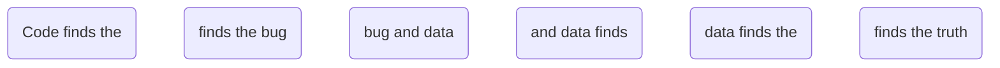
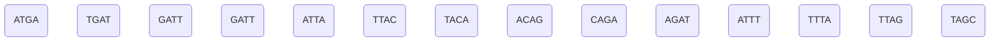
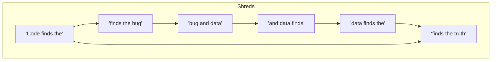
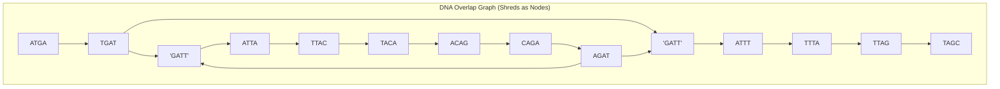
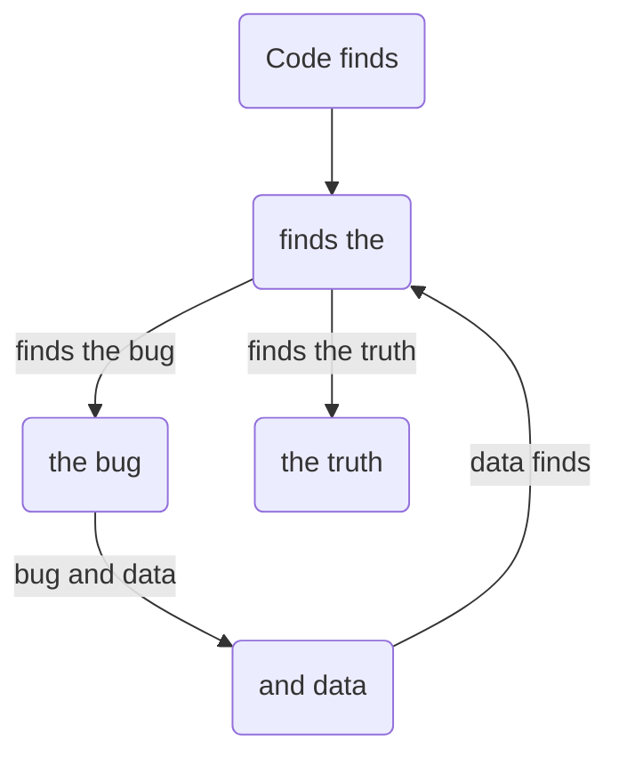
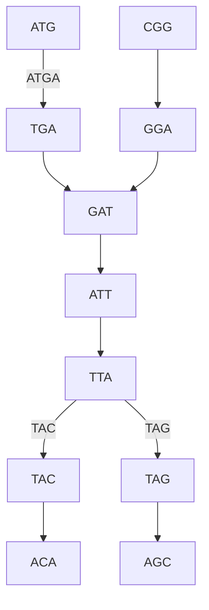

### Summary
- __The Intuitive Idea:__ We can rebuild something by simply overlapping matching ends. This feels right and works for simple cases.
.
- __The "Gotcha" (The Problem):__ Repeats break this simple intuition. A locally correct choice (picking one valid overlap) can lead to a globally incorrect dead-end, stranding unused pieces. You perfectly mirror this with "flies like" and the DNA sequence "CGT".
.
- __The Reframing (The Insight):__ Instead of focusing on the pieces (shreds), focus on the connections (overlaps). By making the overlap the central object (a node in the graph), you elegantly compress the repeat into a single point, exposing the true branching structure. This is the conceptual leap from an Overlap Graph to a de Bruijn Graph.
.
- __The Formal Solution:__ With the problem correctly framed in a de Bruijn graph, the solution becomes finding a path that uses every piece exactly once—an Eulerian path. This provides a formal, non-greedy way to guarantee a globally correct reconstruction.

---

#### **1. SHREDS → STORY (The Setup)**

**Section Title:** "Rebuilding a Single Story"

> "Imagine these are all individual magnets or slips of paper, just handed out. No connections yet—just a jumbled mess of pieces."

> "We're going to reconstruct a single, complete sentence from a pile of shredded phrases. 
> The output of sequencers are these shreds (or kmers).This is exactly how we stitch short DNA 'reads' into one continuous genome, even when it contains repeated sections."

  * **WORDS Example**

      * **Ground truth (hidden):** `Code finds the bug and data finds the truth.`
      * **Shreds you hand out (k=3 words, overlap=2):**
          * `Code finds the`
          * `finds the bug`
          * `bug and data`
          * `and data finds`
          * `data finds the`
          * `finds the truth`

  * **DNA Example (Single Sequence with a Repeat)**

      * **Ground truth (hidden):** `AT-GATT-ACA-GATT-AGC` (The repeat is `GATT`)
      * **Shreds you show (k=4 nt, overlap=3):**
          * `ATGA`, `TGAT`, `GATT` (x2), `ATTA`, `TTAC`, `TACA`, `ACAG`, `CAGA`, `AGAT`, `ATTT`, `TTTA`, `TTAG`, `TAGC`
          * *(Note: The duplicated `GATT` shred is the key repeat.)*

#### **DNA - Individual Shreds**

> "As you try to piece these together, you'll see a challenge. The phrase 'finds the' appears in multiple contexts. This repeat is not an error; it's a feature of the sequence we must solve."

-----

#### **2. OVERLAP GRAPH (The Confusing First Look)**

**Section Title:** “The Overlap Graph: A Tangled Path”

> "If we map these connections by making each shred a node, the path forward is unclear. The graph becomes a confusing web because the repeated elements create false branches and cycles. It’s hard to see the single correct path."

#### **WORDS - Overlap Graph**

> "Which 'finds the' comes first? This view hides the true flow of the sequence."

#### **DNA - Overlap Graph**

> "For the DNA, the problem is even worse. We have two nodes with the exact same label: 'GATT'. Which path is the correct one to follow? The graph becomes nearly impossible to interpret. This is why the overlap graph fails on complex, repetitive sequences."

-----

#### **3. DE BRUIJN GRAPH (The Clearer Picture)**

**Section Title:** “The de Bruijn Graph: Compressing the Repeat”

> "What if we change our perspective? Let's make the **overlaps** the nodes. The original shreds now become the **edges** or arrows that connect them. Watch how this clarifies the path."

#### **WORDS - de Bruijn Graph**

> "Now, the structure is perfectly clear\! The repeat 'finds the' becomes a central hub in our path. We arrive at it, go on a detour to talk about the 'bug' and 'data', and then return to the same 'finds the' hub to finish the sentence. The path is unambiguous."

#### **DNA - de Bruijn Graph**

> "The DNA graph shows the same beautiful structure. The duplicated 'GATT' shreds from the old graph collapse into a **single node** representing the 'GAT' overlap. The path now flows cleanly through it, revealing the loop."

-----

#### **4. EULERIAN PATH (The Final Walkthrough)**

**Section Title:** “The Eulerian Path: Walking the Sequence”

> "Now for the final step. Since our shreds are the edges, a path that travels every single edge exactly once reconstructs the entire sequence. This is called an Eulerian path."

> "Where do we start? Find the node that 'speaks' more than it 'listens'—the one with an extra outgoing arrow. That's our start: **'Code finds'**. The end is the one that listens more: **'the truth'**."

**Action:** Trace the single, continuous path on the de Bruijn graph.

1.  Start with `Code finds`.
2.  Traverse the edge to `finds the`. (Sequence: `Code finds the`)
3.  Take the upper loop for the 'bug'. (Sequence: `...bug and data finds...`)
4.  Arrive back at `finds the`.
5.  Take the final edge to `the truth`. (Sequence: `...the truth`)

> "**The Result:** By following the only path that uses every shred, we perfectly reconstruct the original sentence: **Code finds the bug and data finds the truth.** No guessing, no ambiguity. We let the graph guide us through the repeat to the correct, single answer."